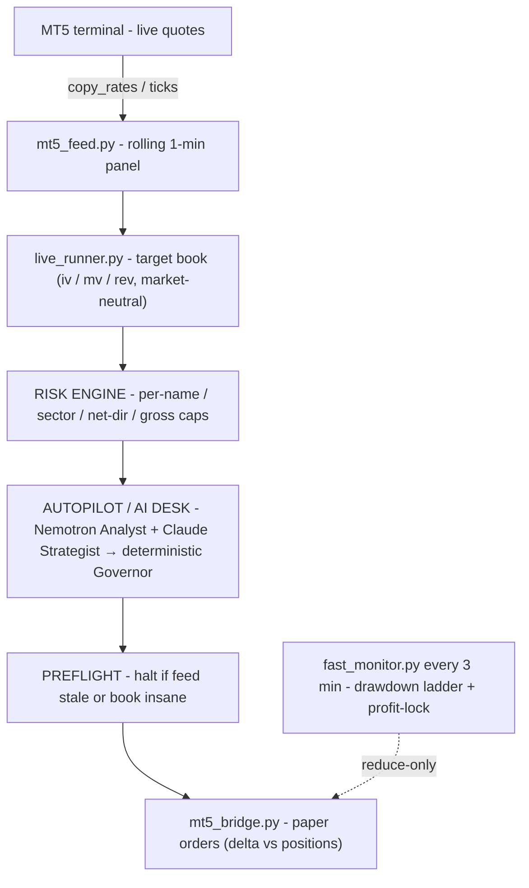

# Model to Market - an AI-native, self-adapting quant trading system

> A complete quant stack - research → strategy → a multi-layer risk engine → native MetaTrader 5 execution → an **autonomous multi-agent AI desk** (NVIDIA Nemotron + Anthropic Claude, Pydantic-validated, Logfire-traced, multi-provider via Doubleword) → cloud deploy (Northflank) - that, **live during the competition, tested its own edges, overturned its own thesis on the data, and re-tuned its strategy, leverage, and risk autonomously.**

Built for the Syphonix × AI Engine **"Model to Market"** competition.
$1,000,000 simulated · scored **70% Return / 15% Drawdown / 10% Sharpe / 5% Risk Discipline**.

**Honest thesis:** I make no claim to a magic alpha - the edge is thin and regime-dependent, and I *prove* that with data rather than hide it. I compete on **engineering, genuine end-to-end sponsor integration, live adaptability, and risk discipline.**

---

## What makes this different

1. **Autopilot - an autonomous, *governed* AI desk.** Each cycle, **NVIDIA Nemotron** (Analyst) classifies the live regime and **Anthropic Claude** (Strategist) proposes the next strategy / gross / cadence - every proposal a **Pydantic-validated** object - then a deterministic **Governor** clamps it to competition-safe limits. It *provably* cannot size up in a no-edge regime, caps an unproven edge, and obeys the drawdown ladder (a reckless `gross=9` proposal is clamped to 3.0; a 2.5 ask in a no-edge regime is forced to 1.0). **AI proposes, a deterministic governor disposes, Logfire traces all of it.** → [`live/autopilot.py`](live/autopilot.py)
2. **I let the data overturn my own thesis.** A live information-coefficient + autocorrelation study showed momentum was the *wrong sign* in this regime - hourly returns persistently **mean-revert** (lag-1 autocorr around −0.1 to −0.2 across windows). I retired my backtest champion and built a mean-reversion strategy in response. → [`live/edge_scan.py`](live/edge_scan.py), [`live/micro_scan.py`](live/micro_scan.py)
3. **I tested the scalper meta honestly - at zero risk.** A dry probe paper-traded on **live ticks** and reported P&L *net of the real spread*: it ruled out FX scalping (spread > move) and found BTC marginal-but-fat-tailed - so I **declined to deploy it**. Discipline over FOMO. → [`live/scalp.py`](live/scalp.py)
4. **Layered, provable risk.** Risk-engine caps + a drawdown ladder + a novel **profit-lock ratchet** + a 3-minute circuit breaker + preflight halts - every AI overlay is strictly *reduce-only* - and the caps + governor are **proven by a runnable test suite** ([`tests/test_safety.py`](tests/test_safety.py), 6/6 passing). → [`risk_engine.py`](risk_engine.py), [`live/profit_lock.py`](live/profit_lock.py), [`live/fast_monitor.py`](live/fast_monitor.py)
5. **Every sponsor is used for something real**, in the live system (details below).

---

## Architecture



<sub>Text version:</sub>

```
  MT5 terminal (live quotes)
        │  copy_rates / ticks
        ▼
  mt5_feed.py ──► panel_live.parquet (rolling 1-min panel, 10 instruments)
        ▼
  live_runner.py ──► target book   [iv / mv / rev, market-neutral, inverse-vol]
        │            + drawdown guard + profit-lock + Nemotron news gate (reduce-only)
        ▼
  RISK ENGINE  ── per-name cap · equity cap · metals-sector cap · net-directional · gross/margin
        ▼
  AUTOPILOT / AI DESK (advisory, governed, reduce-only)
     Analyst   = NVIDIA Nemotron      Strategist = Anthropic Claude
     Governor  = deterministic (clamps to safe bounds)   ·   routed via Doubleword/Claude/Nemotron
        ▼
  PREFLIGHT circuit breaker ── halt if feed stale / book insane
        ▼
  mt5_bridge.py ──► paper orders (delta vs current positions)

  Parallel:  fast_monitor.py (every 3 min: drawdown ladder + profit-lock, reduce-only)
             edge_scan / micro_scan / strat_compare / crypto_scan / scalp  (live research)
             Logfire tracing throughout · Northflank cloud "mission control"
```

---

## Partner technology - what I used and where

| Sponsor | Used for | Where |
|---|---|---|
| **NVIDIA Nemotron** (NIM) | Regime Analyst in Autopilot, news/event risk gate (reduce-only), catalog auto-resolver (immune to model drift) | `live/autopilot.py`, `live/news_risk_gate.py`, `live/ai_gateway.py` |
| **Anthropic Claude** | Strategist in Autopilot, desk rationale, ops + post-round red-team memos | `live/autopilot.py`, `live/desk.py`, `live/ops_agent.py`, `live/round_review.py` |
| **Pydantic** | Structured/validated AI outputs (a decision *can't* be out of bounds), typed agents, **Logfire** end-to-end tracing | `live/ai_gateway.py`, `live/desk_pydantic_ai.py`, all live modules (`--logfire`) |
| **Doubleword** | Opt-in private-inference provider in the multi-provider gateway | `live/ai_gateway.py` |
| **MetaTrader 5** | Native feed (`copy_rates`/ticks) + a notional→lots bridge (USD-quote/base/cross), delta trading, dry-run safety | `live/mt5_feed.py`, `live/mt5_bridge.py` |
| **Northflank** | Containerised cloud "mission control" (dashboard + AI desk + Logfire) | `live/server.py`, `live/Dockerfile`, `live/northflank.json` |

---

## Research & rigor - honesty as a feature

- **IC surface** across a full lookback×horizon grid, with **t-stat significance** and an **autocorrelation study**, run *live on the competition feed* - not just the archive. → `live/edge_scan.py`, `live/micro_scan.py`
- **Sub-period consistency** scoring (`live/strat_compare.py`) - I choose what *generalises*, not what fits the recent window (the direct antidote to overfitting).
- **Overfitting controls:** Deflated Sharpe ≈ 0.26, Probability of Backtest Overfitting ≈ 21% (Bailey & López de Prado) → *trust the direction of findings, not the magnitude.*
- **Real venue cost calibration** - and I *discovered live* that true spreads (2–6 bps off-hours) dwarf the M1-derived estimate, which reshaped my cadence toward low turnover.
- **Negative results I kept and published:** momentum (wrong sign live), a reversal sleeve that died to cost, HRP, an ensemble, an order-book/microstructure dead-end, crypto (failed a live validation gate), and FX/BTC scalping (probed at zero risk, declined).
- **Full dated research journey** - every experiment, every negative result, the overfit math, the shrinkage-MV win: **[`RESEARCH_LOG.md`](RESEARCH_LOG.md)**.

---

## The standout: live, data-driven self-adaptation

The competition opened choppy and momentum-adverse. The system **measured and adapted on live data** rather than hoping:
- Diagnosed a near-zero/negative momentum edge live; **slowed cadence** to cut whipsaw and **cut gross** when the edge was absent.
- **Overturned its own momentum thesis** for mean-reversion when the autocorrelation demanded it (`rev` strategy).
- **Autopilot** closes the loop autonomously - and the **governor** guarantees the AI can only ever *reduce* risk or stay within safe bounds.
- The AI desk surfaced a real concentration risk (co-dominant metals shorts), which I then fixed in code with a **metals-sector cap**.

Full write-up, demo script, and sponsor detail: **[`TECH_PRIZE_SUBMISSION.md`](TECH_PRIZE_SUBMISSION.md)**.

---

## Risk & safety engineering

- Per-name ≤30% of gross · per-name ≤75% of equity · **metals-sector cap** ≤35% · net-directional & gross/margin ceilings under every penalty tier.
- **Drawdown ladder** (5/8/12% → ×0.7/0.4/0.2) shared by the cycle and the 3-min monitor.
- **Profit-lock ratchet** - once up ≥0.5%, de-risks as gains are surrendered (give back 25/50/75% → ×0.7/0.4/0.2): locks profit *without* a stop's whipsaw.
- **Preflight** halts a cycle on a stale feed or insane book. **Paper-only** throughout; every AI overlay is reduce-only and can never override the deterministic risk engine.

---

## Run it (demo)

```powershell
# one control panel does everything
Quanthack.bat            # -> menu: setup / preview / go-live / automate / dashboard / logs

# or directly:
python live/mt5_feed.py --out panel_live.parquet --lookback-days 5   # pull live panel
python live/edge_scan.py --days 5                                    # live regime + IC + t-stats
python live/autopilot.py --logfire                                   # AI desk proposes (SHADOW; safe)
powershell -ExecutionPolicy Bypass -File live/run_cycle.ps1          # full cycle (dry unless runtime.json live=true)
```
Everything is **dry-run by default** and requires explicit confirmation to send (paper/contest account only).

---

## Repo map

| Area | Files |
|---|---|
| Strategy | `strategies/cov_aware.py`, `strategies/diversified_vol_target.py` |
| Engine / risk | `engine.py`, `risk_engine.py`, `config.py`, `metrics.py`, `overfit.py` |
| Live trading | `live/mt5_feed.py`, `live/live_runner.py`, `live/mt5_bridge.py`, `live/preflight.py`, `live/fast_monitor.py`, `live/profit_lock.py` |
| **Autopilot / AI** | `live/autopilot.py`, `live/ask.py` (NL "ask the desk"), `live/eval_autopilot.py` (Pydantic decision-evals), `live/nemotron_benchmark.py` (NIM vs Doubleword self-host), `live/ai_gateway.py`, `live/desk.py`, `live/desk_pydantic_ai.py`, `live/news_risk_gate.py` |
| Live research | `live/edge_scan.py`, `live/micro_scan.py`, `live/strat_compare.py`, `live/crypto_scan.py`, `live/scalp.py`, `live/regime_report.py` |
| Cloud / ops | `live/server.py`, `live/Dockerfile`, `live/northflank.json`, `live/run_cycle.ps1`, `setup_vps.ps1` |
| Tests | `tests/test_safety.py` - runnable proofs of the governor / profit-lock / risk caps |
| Docs | `TECH_PRIZE_SUBMISSION.md`, `NVIDIA.md`, `DEMO.md`, `RESEARCH_LOG.md`, `FINALS_PLAYBOOK.md`, `VPS_SETUP.md` |

---

## Honest assessment

No large or certain alpha - the edge is thin and regime-dependent, and I say so. The most competition-relevant thing I built wasn't a magic signal; it was a **system that measures the live market, tests its own ideas, kills the ones that don't survive contact with the data, and re-tunes itself - observably and safely.** That is the AI-native thesis, made real.
